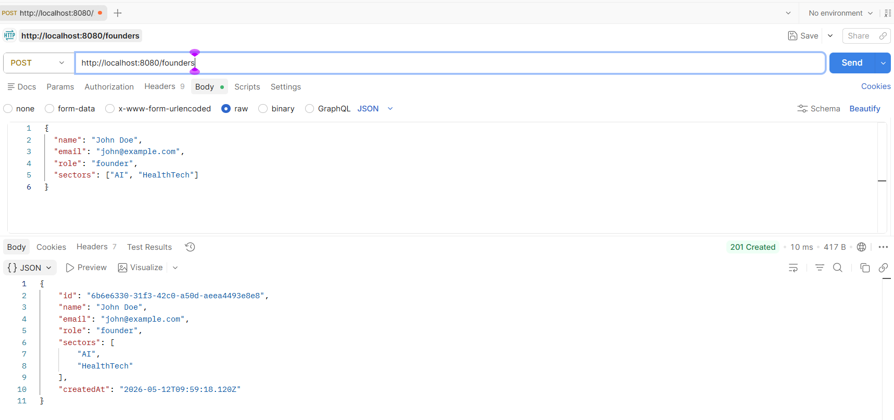
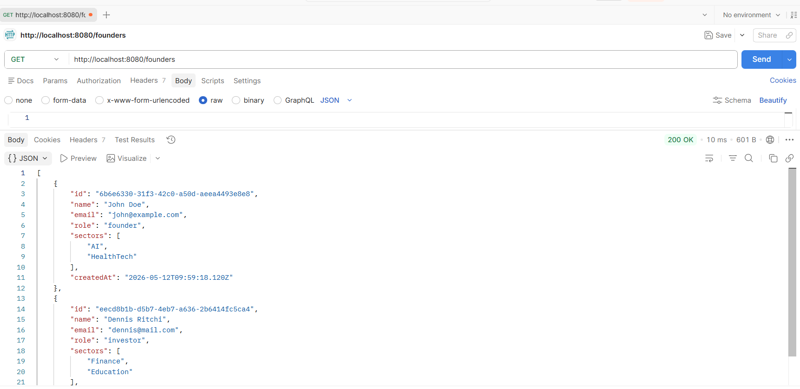
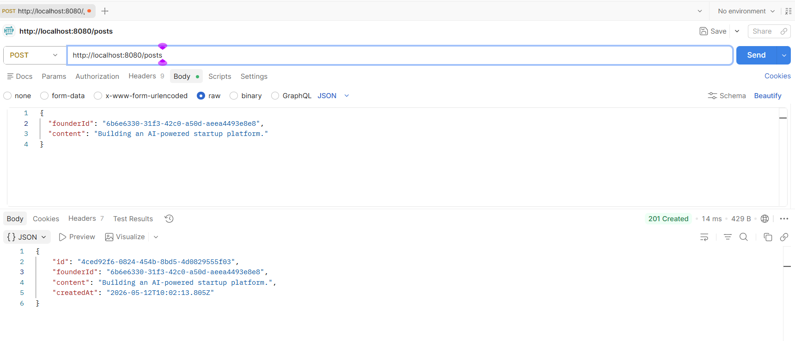
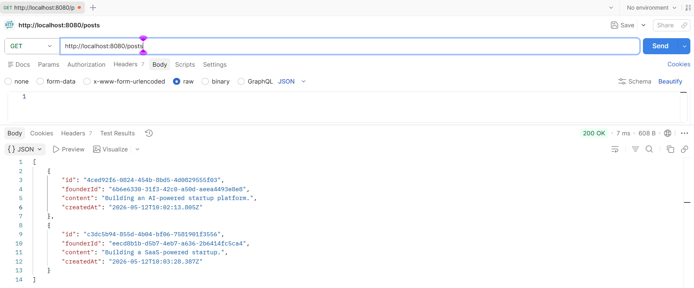
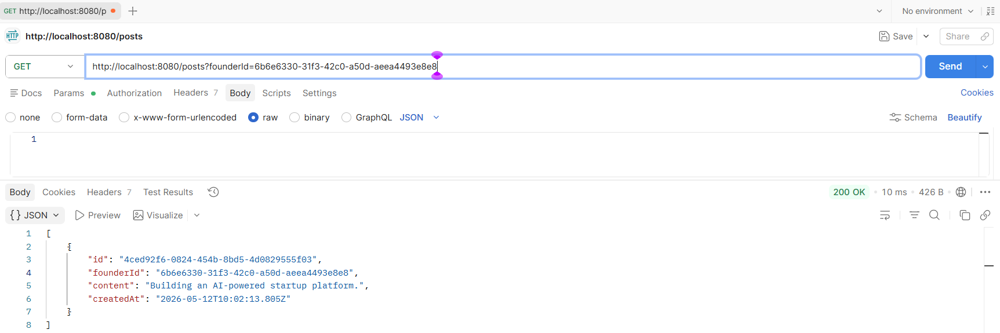

# Venture Launcher Backend Test

A simple REST API built with Node.js and Express to manage founders and posts using in-memory data storage (no database).

## Folder Structure
```
venture-launcher/
│
├── package.json
├── package-lock.json
├── README.md
├── server.js
│
└── routes/
    ├── founders.js
    └── posts.js
```
## Local Setup Instructions

### Clone the Repo

```
git clone https://github.com/srinivas-batthula/venture-launcher.git
```

### Installation

```bash
npm install
```

### Run the Server

```bash
npm start
```

---

Server runs at:

- http://localhost:8080

---

## API Endpoints

### 1. Founders

#### POST /founders

Create a founder.

**Request Body**

```json
{
  "name": "John Doe",
  "email": "john@example.com",
  "role": "founder",
  "sectors": ["AI", "HealthTech"]
}
```

#### GET /founders

Lists all founders.

---

### 2. Posts

#### POST /posts

Create a post.

**Request Body**

```json
{
  "founderId": "FOUNDER'S_ID_HERE",
  "content": "Building an AI-powered startup platform."
}
```

#### GET /posts

Lists all posts.

#### GET /posts?founderId=FOUNDER'S_ID_HERE

List's posts by a specific founder.

---
## Response Formats

### Status Codes

- 201 Created
- 200 OK
- 400 Bad Request
- 404 Not Found

---

### Error Response Format

```json
{
  "error": "message"
}
```

## Testing Results (Postman)

### POST /founders


### GET /founders


### POST /posts


### GET /posts


### GET /posts?founderId=...


## Timeline & Next Step

- This assignment was completed and submitted within the requested timeline.

- If the implementation meets the expected standards, the next step is to discuss onboarding and begin contributing to the actual backend development of Venture Launcher.
